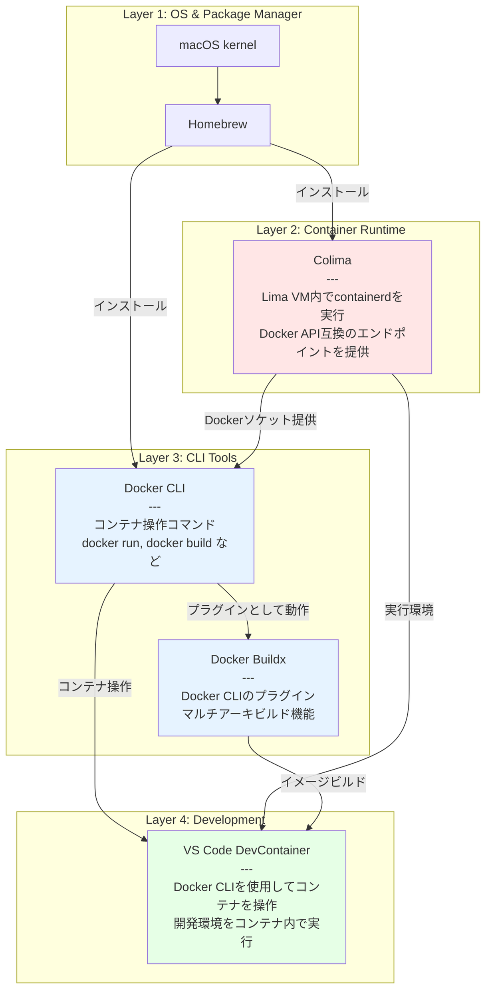
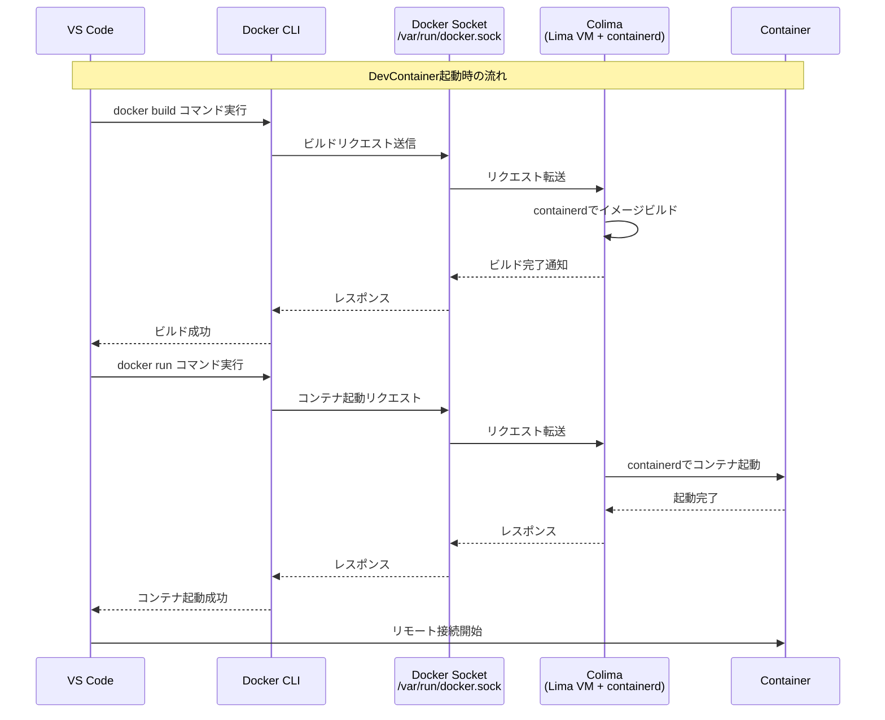
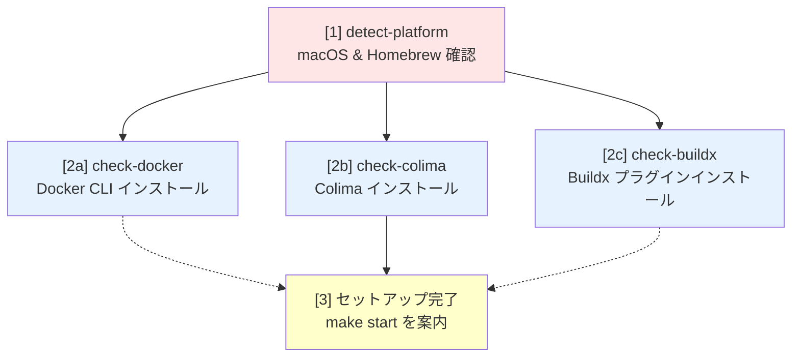
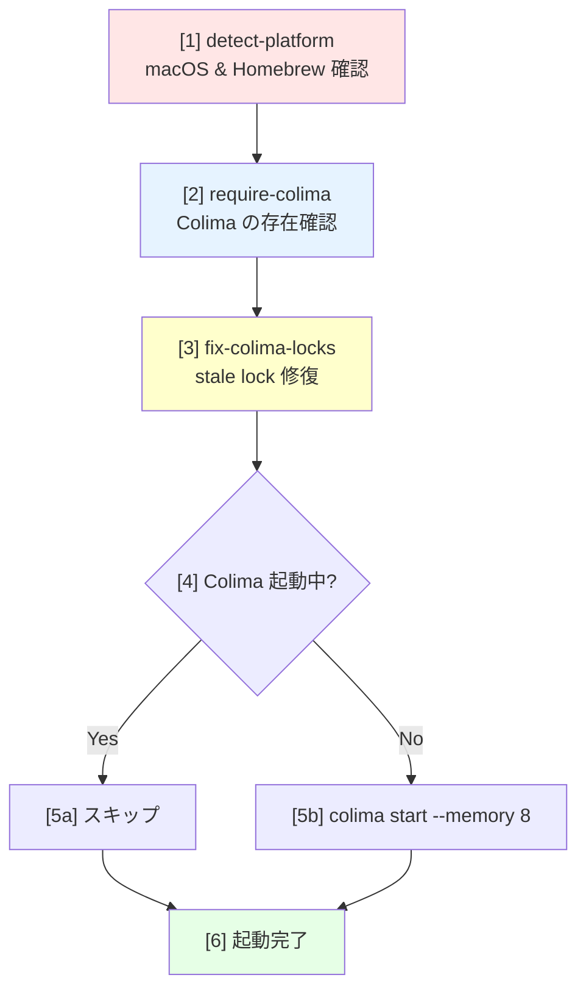
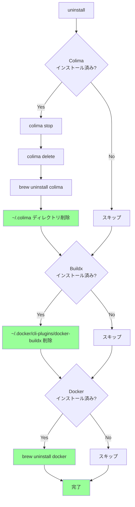

# Makefile 使用ガイド

このドキュメントは、macOS で Docker Desktop の代わりに Colima を使用した DevContainer 環境をセットアップするための Makefile の使い方と内部構造を説明します。

## 概要

この Makefile は、macOS 上で以下の3つのコンポーネントを自動的にセットアップします：

- **Docker CLI**: コンテナ操作のためのコマンドラインツール
- **Colima**: Docker Desktop の代替となる軽量なコンテナランタイム
- **Docker Buildx**: マルチプラットフォームビルドをサポートするプラグイン

## クイックリファレンス

### 基本コマンド

| コマンド | 説明 |
|---------|------|
| `make help` | 使用可能なコマンドを表示（デフォルト） |
| `make setup` | Docker CLI、Colima、Docker Buildx をインストール |
| `make start` | Colima を起動 |
| `make launch-sandbox <path>` | ターゲットプロジェクトを指定して AI Sandbox を起動 |
| `make update-tools` | Claude Code / Codex だけを最新版に更新 |
| `make update-all` | 共有 Docker イメージ全体をキャッシュなしで更新 |
| `make uninstall` | すべてのコンポーネントをアンインストール |

### 使用例

#### 初回セットアップ

```bash
# リポジトリをクローン
git clone https://github.com/BlueEventHorizon/AI-DevContainer
cd AI-DevContainer

# 環境をセットアップ（初回のみ）
make setup

# Colima を起動
make start
```

実行時の出力例:
```
✅ Docker is already installed.
✅ Colima is already installed.
🛠  Docker buildx not found. Installing...
   Detected architecture: arm64 (darwin-arm64)
   Downloading buildx v0.26.1...
✅ Docker buildx installed successfully.
✅ Setup complete!
Next: Run 'make start' to start Colima.

🟢 Starting Colima...
✅ Colima started successfully.
✅ Colima is ready!
Next: Run 'make launch-sandbox /path/to/project' to launch AI Sandbox.
```

#### 2回目以降の起動

Colima が停止している場合:

```bash
make start
```

`make start` は Colima の stale なロックを修復してから `colima start --memory 8` を実行します。Mac 再起動後や Docker が起動していない場合は、通常このコマンドだけで十分です。

#### AI Sandbox の起動

AI Sandbox リポジトリ直下から起動する場合:

```bash
make launch-sandbox ~/projects/my-app
```

オプションを渡す場合:

```bash
make launch-sandbox ~/projects/my-app OPTIONS="--rebuild"
make launch-sandbox ~/projects/my-app OPTIONS="--vscode"
```

Claude Code / Codex だけを最新版に更新する場合:

```bash
make update-tools
```

`make update-tools` は Dockerfile の `AI_TOOLS_CACHE_BUST` build arg を更新して、OS/apt レイヤーのキャッシュを再利用したまま Claude Code / Codex の取得レイヤー以降だけを再実行します。

Dockerfile 全体の変更や OS パッケージ更新を反映する場合:

```bash
make update-all
```

`make update-all` は `docker build --no-cache -t ai-sandbox .devcontainer/` を実行するため、全レイヤーをキャッシュなしで作り直します。イメージは全ターゲットプロジェクトで共有されるため、プロジェクトごとに更新・再ビルドする必要はありません。完了後は `make launch-sandbox ~/projects/my-app` のように任意のターゲットを起動します。

#### 停止

```bash
colima stop
```

#### トラブルシューティング

**Colima が起動しない場合:**

```bash
# すべて削除して再インストール
make uninstall
make setup
make start
```

**環境を完全にリセット:**

```bash
# すべて削除して再セットアップ
make uninstall
make setup
make start
```

## コンポーネント詳細

### 各コンポーネントの役割

| コンポーネント | 役割 | 依存先 | 提供するもの |
|--------------|------|--------|------------|
| **Colima** | コンテナランタイム環境。Lima VM 内で containerd を実行し、Docker 互換の API エンドポイント (`/var/run/docker.sock`) を提供 | macOS, Lima, containerd | Docker ソケット (`unix:///var/run/docker.sock`) |
| **Docker CLI** | コンテナ操作のためのコマンドラインツール。Colima が提供する Docker ソケットに接続 | Colima (実行中のソケット) | `docker` コマンド |
| **Buildx** | Docker CLI のプラグイン。マルチプラットフォームビルドを可能にする | Docker CLI | `docker buildx` コマンド |
| **DevContainer** | VS Code の機能。Docker CLI を使ってコンテナを起動し、開発環境として使用 | Docker CLI, Colima (実行中) | 統合開発環境 |

### なぜこの構成なのか？

#### Docker Desktop の代替として Colima を使用

- Docker Desktop はライセンス料が必要（企業利用）
- Colima は OSS で無料
- Colima は軽量（Lima VM ベース）

#### Docker CLI と Colima は別コンポーネント

- Docker CLI: クライアント（コマンド）
- Colima: サーバー（実行環境）
- 分離されているため、どちらか一方を更新しても影響が少ない

#### Buildx はプラグイン

- Docker CLI 本体とは独立してインストール
- `~/.docker/cli-plugins/` に配置されると自動認識される
- DevContainer のマルチアーキビルドに必要

## 内部動作の詳細

このセクションでは、各コンポーネントがどのように連携して動作するかを詳しく説明します。

### ランタイム依存関係

各コンポーネントのランタイムでの役割と依存関係:


```mermaid
graph TB
    subgraph "Layer 1: OS & Package Manager"
        OS[macOS kernel]
        HB[Homebrew]
    end

    subgraph "Layer 2: Container Runtime"
        COLIMA[Colima<br/>---<br/>Lima VM内でcontainerdを実行<br/>Docker API互換のエンドポイントを提供]
    end

    subgraph "Layer 3: CLI Tools"
        DOCKER_CLI[Docker CLI<br/>---<br/>コンテナ操作コマンド<br/>docker run, docker build など]
        BUILDX[Docker Buildx<br/>---<br/>Docker CLIのプラグイン<br/>マルチアーキビルド機能]
    end

    subgraph "Layer 4: Development"
        DEVCONTAINER[VS Code DevContainer<br/>---<br/>Docker CLIを使用してコンテナを操作<br/>開発環境をコンテナ内で実行]
    end

    OS --> HB
    HB -->|インストール| COLIMA
    HB -->|インストール| DOCKER_CLI

    COLIMA -->|Dockerソケット提供| DOCKER_CLI
    DOCKER_CLI -->|プラグインとして動作| BUILDX

    DOCKER_CLI -->|コンテナ操作| DEVCONTAINER
    COLIMA -->|実行環境| DEVCONTAINER
    BUILDX -->|イメージビルド| DEVCONTAINER

    style COLIMA fill:#ffe6e6
    style DOCKER_CLI fill:#e6f3ff
    style BUILDX fill:#e6f3ff
    style DEVCONTAINER fill:#e6ffe6
```

### ランタイム時の通信フロー

DevContainer 起動時の各コンポーネント間の通信:


```mermaid
sequenceDiagram
    participant VSC as VS Code
    participant DCLI as Docker CLI
    participant SOCK as Docker Socket<br/>/var/run/docker.sock
    participant COLIMA as Colima<br/>(Lima VM + containerd)
    participant CONTAINER as Container

    Note over VSC,CONTAINER: DevContainer起動時の流れ

    VSC->>DCLI: docker build コマンド実行
    DCLI->>SOCK: ビルドリクエスト送信
    SOCK->>COLIMA: リクエスト転送
    COLIMA->>COLIMA: containerdでイメージビルド
    COLIMA-->>SOCK: ビルド完了通知
    SOCK-->>DCLI: レスポンス
    DCLI-->>VSC: ビルド成功

    VSC->>DCLI: docker run コマンド実行
    DCLI->>SOCK: コンテナ起動リクエスト
    SOCK->>COLIMA: リクエスト転送
    COLIMA->>CONTAINER: containerdでコンテナ起動
    CONTAINER-->>COLIMA: 起動完了
    COLIMA-->>SOCK: レスポンス
    SOCK-->>DCLI: レスポンス
    DCLI-->>VSC: コンテナ起動成功

    VSC->>CONTAINER: リモート接続開始
```

### セットアップフロー

`make setup` がコンポーネントをインストールする際の依存関係:


```mermaid
graph TB
    STEP1["[1] detect-platform<br/>macOS & Homebrew 確認"]
    STEP2A["[2a] check-docker<br/>Docker CLI インストール"]
    STEP2B["[2b] check-colima<br/>Colima インストール"]
    STEP2C["[2c] check-buildx<br/>Buildx プラグインインストール"]
    STEP3["[3] セットアップ完了<br/>make start を案内"]

    STEP1 --> STEP2A
    STEP1 --> STEP2B
    STEP1 --> STEP2C
    STEP2A -.-> STEP3
    STEP2B --> STEP3
    STEP2C -.-> STEP3

    style STEP1 fill:#ffe6e6
    style STEP2A fill:#e6f3ff
    style STEP2B fill:#e6f3ff
    style STEP2C fill:#e6f3ff
    style STEP3 fill:#ffffcc
```

**注意**:
- ステップ2（a/b/c）は並列実行される（Makeの依存関係により）
- Buildx は Docker CLI のプラグインだが、インストール順序は問わない（プラグインディレクトリに配置されるだけ）

### 起動フロー

`make start` は Colima の起動だけを担当します。初回セットアップは `make setup` で済ませておく必要があります。


```mermaid
graph TB
    STEP1["[1] detect-platform<br/>macOS & Homebrew 確認"]
    STEP2["[2] require-colima<br/>Colima の存在確認"]
    STEP3["[3] fix-colima-locks<br/>stale lock 修復"]
    STEP4{"[4] Colima 起動中?"}
    STEP5["[5a] スキップ"]
    STEP6["[5b] colima start --memory 8"]
    STEP7["[6] 起動完了"]

    STEP1 --> STEP2
    STEP2 --> STEP3
    STEP3 --> STEP4
    STEP4 -->|Yes| STEP5
    STEP4 -->|No| STEP6
    STEP5 --> STEP7
    STEP6 --> STEP7

    style STEP1 fill:#ffe6e6
    style STEP2 fill:#e6f3ff
    style STEP3 fill:#ffffcc
    style STEP7 fill:#e6ffe6
```

### クリーンアップフロー

`make uninstall` の削除順序:


```mermaid
graph TD
    A[uninstall]
    A --> B1{Colima<br/>インストール済み?}
    B1 -->|No| B2[スキップ]
    B1 -->|Yes| B3[colima stop]
    B3 --> B4[colima delete]
    B4 --> B5[brew uninstall colima]
    B5 --> B6[~/.colima ディレクトリ削除]

    B6 --> C1{Buildx<br/>インストール済み?}
    B2 --> C1
    C1 -->|No| C2[スキップ]
    C1 -->|Yes| C3[~/.docker/cli-plugins/docker-buildx 削除]

    C3 --> D1{Docker<br/>インストール済み?}
    C2 --> D1
    D1 -->|No| D2[スキップ]
    D1 -->|Yes| D3[brew uninstall docker]

    D3 --> E[完了]
    D2 --> E

    style B6 fill:#9f9
    style C3 fill:#9f9
    style D3 fill:#9f9
    style E fill:#9f9
```

**削除順序が重要な理由:**

1. **Colima を先に停止**: 実行中のコンテナを停止してからランタイムを削除
2. **Buildx を削除**: Docker CLI のプラグインなので CLI より先に削除
3. **Docker CLI を最後に削除**: 他のコンポーネントに依存されていないため最後

## ターゲット詳細説明

### ユーザー向けターゲット

| ターゲット | 説明 | 依存関係 |
|-----------|------|---------|
| `help` | 使用可能なコマンドを表示（デフォルト） | なし |
| `setup` | Docker CLI、Colima、Docker Buildx をインストール | `detect-platform`, `check-docker`, `check-colima`, `check-buildx` |
| `start` | Colima を起動 | `detect-platform`, `require-colima`, `fix-colima-locks` |
| `launch-sandbox` | 指定したプロジェクトを AI Sandbox で起動 | なし |
| `update-tools` | 共有 Docker イメージ内の Claude Code / Codex 取得レイヤーだけを更新 | なし |
| `update-all` | 共有 Docker イメージ全体をキャッシュなしで更新 | なし |
| `uninstall` | すべてのコンポーネントをアンインストール | なし |

### 内部ターゲット（直接実行は非推奨）

| ターゲット | 説明 | 依存関係 |
|-----------|------|---------|
| `detect-platform` | macOS かつ Homebrew がインストールされているか確認 | なし |
| `require-colima` | Colima がインストール済みか確認、なければ `make setup` を案内 | なし |
| `check-docker` | Docker がインストールされているか確認、なければインストール | なし |
| `check-colima` | Colima がインストールされているか確認、なければインストール | なし |
| `check-buildx` | Buildx プラグインがインストールされているか確認、なければインストール | なし |

### `setup` の動作

1. **プラットフォーム検証** (`detect-platform`)
   - macOS であることを確認
   - Homebrew がインストールされていることを確認
   - いずれかの条件が満たされない場合、エラーで終了

2. **コンポーネントのインストール確認**
   - `check-docker`: Docker CLI の存在確認、未インストールなら `brew install docker`
   - `check-colima`: Colima の存在確認、未インストールなら `brew install colima`
   - `check-buildx`: Buildx プラグインの存在確認、未インストールなら以下を実行:
     - CPU アーキテクチャを自動検出 (`uname -m`)
     - GitHub API から最新版のバージョン番号を取得
     - 対応するバイナリをダウンロード
     - `~/.docker/cli-plugins/docker-buildx` に配置して実行権限を付与

3. **次の操作を案内**
   - セットアップ完了後、`make start` の実行を案内

### `start` の動作

1. **プラットフォーム検証** (`detect-platform`)
   - macOS であることを確認
   - Homebrew がインストールされていることを確認

2. **Colima の存在確認** (`require-colima`)
   - Colima が未インストールなら `make setup` を案内して終了

3. **Colima/Lima の stale lock 修復** (`fix-colima-locks`)
   - スリープ、強制再起動、クラッシュ後に残る stale なディスクロックを削除

4. **Colima の起動**
   - `colima status` で起動状態を確認
   - 未起動なら `colima start --memory 8` を実行
   - 既に起動中ならスキップ

### `uninstall` の動作

順番にコンポーネントをアンインストールします:

1. **Colima のアンインストール**
   - Colima を停止 (`colima stop`)
   - Colima のインスタンスを削除 (`colima delete`)
   - Homebrew からアンインストール (`brew uninstall colima`)
   - データディレクトリを削除 (`rm -rf ~/.colima`)

2. **Buildx のアンインストール**
   - プラグインファイルを削除 (`rm -f ~/.docker/cli-plugins/docker-buildx`)

3. **Docker のアンインストール**
   - Homebrew からアンインストール (`brew uninstall docker`)

### エラーハンドリング

すべての重要な操作には以下のエラーハンドリングが実装されています:

- **インストール失敗**: `brew install` が失敗した場合、エラーメッセージを表示して終了
- **ダウンロード失敗**: Buildx のダウンロード失敗時、一時ファイルをクリーンアップして終了
- **起動失敗**: `colima start` が失敗した場合、エラーメッセージを表示して終了
- **アンインストール**: エラーが発生しても処理を継続（`|| true` で保護）

## サポート環境と制限事項

### サポートされる環境

- **OS**: macOS のみ
- **CPU アーキテクチャ**:
  - Intel (x86_64)
  - Apple Silicon (arm64)
- **必須ツール**:
  - Homebrew

### 制限事項

- Linux では動作しません（Homebrew と darwin バイナリに依存）
- Windows では動作しません
- Homebrew がインストールされている必要があります
- インターネット接続が必要です（Buildx のダウンロード時）

## 参考リンク

- [Colima](https://github.com/abiosoft/colima) - Docker Desktop の代替
- [Docker Buildx](https://github.com/docker/buildx) - Docker のビルドプラグイン
- [Homebrew](https://brew.sh) - macOS のパッケージマネージャー
