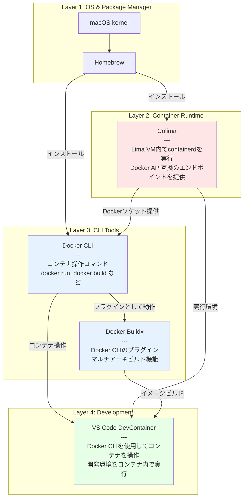
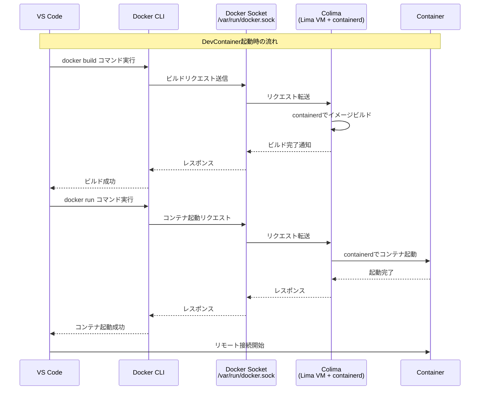
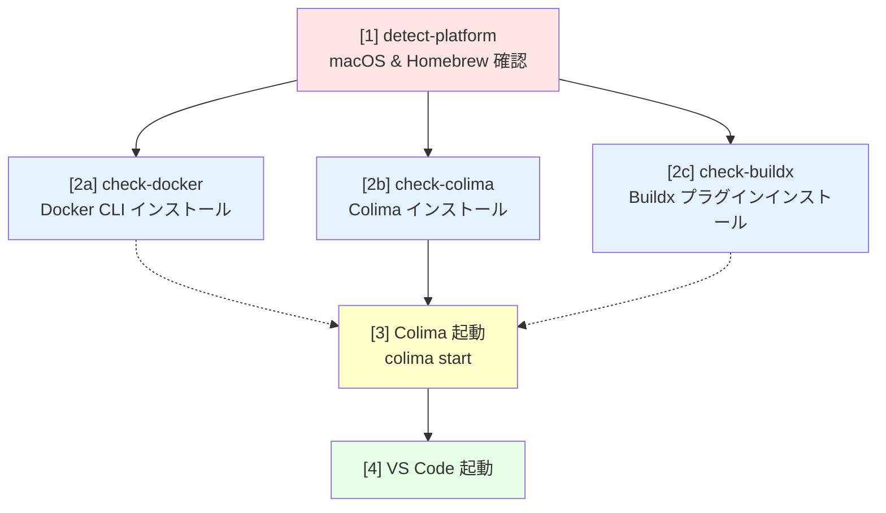
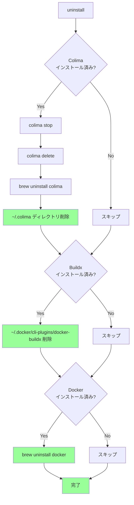

# Makefile 使用ガイド

このドキュメントは、macOS で Docker Desktop の代わりに Colima を使用した DevContainer 環境をセットアップするための Makefile の使い方と内部構造を説明します。

## 概要

この Makefile は、macOS 上で以下の3つのコンポーネントを自動的にセットアップします：

- **Docker CLI**: コンテナ操作のためのコマンドラインツール
- **Colima**: Docker Desktop の代替となる軽量なコンテナランタイム
- **Docker Buildx**: マルチプラットフォームビルドをサポートするプラグイン

## クイックリファレンス

### 基本コマンド

| コマンド | 説明 |
|---------|------|
| `make help` | 使用可能なコマンドを表示（デフォルト） |
| `make install` | 環境全体をセットアップして起動 |
| `make uninstall` | すべてのコンポーネントをアンインストール |

### 使用例

#### 初回セットアップ

```bash
# リポジトリをクローン
git clone https://github.com/BlueEventHorizon/AI-DevContainer
cd AI-DevContainer

# 環境をセットアップ
make install
```

実行時の出力例:
```
✅ Docker is already installed.
✅ Colima is already installed.
🛠  Docker buildx not found. Installing...
   Detected architecture: arm64 (darwin-arm64)
   Downloading buildx v0.26.1...
✅ Docker buildx installed successfully.
🟢 Starting Colima...
✅ Colima started successfully.
🚀 You can launch up DevContainer with VS Code
```

#### 2回目以降の起動

Colima が停止している場合:

```bash
colima start
```

または、すべてをチェックして起動:

```bash
make install
```

#### 停止

```bash
colima stop
```

#### トラブルシューティング

**Colima が起動しない場合:**

```bash
# すべて削除して再インストール
make uninstall
make install
```

**環境を完全にリセット:**

```bash
# すべて削除して再セットアップ
make uninstall
make install
```

## コンポーネント詳細

### 各コンポーネントの役割

| コンポーネント | 役割 | 依存先 | 提供するもの |
|--------------|------|--------|------------|
| **Colima** | コンテナランタイム環境。Lima VM 内で containerd を実行し、Docker 互換の API エンドポイント (`/var/run/docker.sock`) を提供 | macOS, Lima, containerd | Docker ソケット (`unix:///var/run/docker.sock`) |
| **Docker CLI** | コンテナ操作のためのコマンドラインツール。Colima が提供する Docker ソケットに接続 | Colima (実行中のソケット) | `docker` コマンド |
| **Buildx** | Docker CLI のプラグイン。マルチプラットフォームビルドを可能にする | Docker CLI | `docker buildx` コマンド |
| **DevContainer** | VS Code の機能。Docker CLI を使ってコンテナを起動し、開発環境として使用 | Docker CLI, Colima (実行中) | 統合開発環境 |

### なぜこの構成なのか？

#### Docker Desktop の代替として Colima を使用

- Docker Desktop はライセンス料が必要（企業利用）
- Colima は OSS で無料
- Colima は軽量（Lima VM ベース）

#### Docker CLI と Colima は別コンポーネント

- Docker CLI: クライアント（コマンド）
- Colima: サーバー（実行環境）
- 分離されているため、どちらか一方を更新しても影響が少ない

#### Buildx はプラグイン

- Docker CLI 本体とは独立してインストール
- `~/.docker/cli-plugins/` に配置されると自動認識される
- DevContainer のマルチアーキビルドに必要

## 内部動作の詳細

このセクションでは、各コンポーネントがどのように連携して動作するかを詳しく説明します。

### ランタイム依存関係

各コンポーネントのランタイムでの役割と依存関係:



### ランタイム時の通信フロー

DevContainer 起動時の各コンポーネント間の通信:



### インストールフロー

Makefile がコンポーネントをインストールする際の依存関係:



**注意**:
- ステップ2（a/b/c）は並列実行される（Makeの依存関係により）
- Colima の起動には Docker CLI は不要だが、実行時には必要
- Buildx は Docker CLI のプラグインだが、インストール順序は問わない（プラグインディレクトリに配置されるだけ）

### クリーンアップフロー

`make uninstall` の削除順序:



**削除順序が重要な理由:**

1. **Colima を先に停止**: 実行中のコンテナを停止してからランタイムを削除
2. **Buildx を削除**: Docker CLI のプラグインなので CLI より先に削除
3. **Docker CLI を最後に削除**: 他のコンポーネントに依存されていないため最後

## ターゲット詳細説明

### ユーザー向けターゲット

| ターゲット | 説明 | 依存関係 |
|-----------|------|---------|
| `help` | 使用可能なコマンドを表示（デフォルト） | なし |
| `install` | 環境全体をセットアップして起動 | `detect-platform`, `check-docker`, `check-colima`, `check-buildx` |
| `uninstall` | すべてのコンポーネントをアンインストール | なし |

### 内部ターゲット（直接実行は非推奨）

| ターゲット | 説明 | 依存関係 |
|-----------|------|---------|
| `detect-platform` | macOS かつ Homebrew がインストールされているか確認 | なし |
| `check-docker` | Docker がインストールされているか確認、なければインストール | なし |
| `check-colima` | Colima がインストールされているか確認、なければインストール | なし |
| `check-buildx` | Buildx プラグインがインストールされているか確認、なければインストール | なし |

### `install` の動作

1. **プラットフォーム検証** (`detect-platform`)
   - macOS であることを確認
   - Homebrew がインストールされていることを確認
   - いずれかの条件が満たされない場合、エラーで終了

2. **コンポーネントのインストール確認**
   - `check-docker`: Docker CLI の存在確認、未インストールなら `brew install docker`
   - `check-colima`: Colima の存在確認、未インストールなら `brew install colima`
   - `check-buildx`: Buildx プラグインの存在確認、未インストールなら以下を実行:
     - CPU アーキテクチャを自動検出 (`uname -m`)
     - GitHub API から最新版のバージョン番号を取得
     - 対応するバイナリをダウンロード
     - `~/.docker/cli-plugins/docker-buildx` に配置して実行権限を付与

3. **Colima の起動**
   - `colima status` で起動状態を確認
   - 未起動なら `colima start` を実行
   - 既に起動中ならスキップ

4. **VS Code の起動（オプション）**
   - `code` コマンドが存在すれば、現在のディレクトリで VS Code を起動
   - 存在しなければ警告メッセージのみ表示（エラーにはしない）

### `uninstall` の動作

順番にコンポーネントをアンインストールします:

1. **Colima のアンインストール**
   - Colima を停止 (`colima stop`)
   - Colima のインスタンスを削除 (`colima delete`)
   - Homebrew からアンインストール (`brew uninstall colima`)
   - データディレクトリを削除 (`rm -rf ~/.colima`)

2. **Buildx のアンインストール**
   - プラグインファイルを削除 (`rm -f ~/.docker/cli-plugins/docker-buildx`)

3. **Docker のアンインストール**
   - Homebrew からアンインストール (`brew uninstall docker`)

### エラーハンドリング

すべての重要な操作には以下のエラーハンドリングが実装されています:

- **インストール失敗**: `brew install` が失敗した場合、エラーメッセージを表示して終了
- **ダウンロード失敗**: Buildx のダウンロード失敗時、一時ファイルをクリーンアップして終了
- **起動失敗**: `colima start` が失敗した場合、エラーメッセージを表示して終了
- **アンインストール**: エラーが発生しても処理を継続（`|| true` で保護）

## サポート環境と制限事項

### サポートされる環境

- **OS**: macOS のみ
- **CPU アーキテクチャ**:
  - Intel (x86_64)
  - Apple Silicon (arm64)
- **必須ツール**:
  - Homebrew

### 制限事項

- Linux では動作しません（Homebrew と darwin バイナリに依存）
- Windows では動作しません
- Homebrew がインストールされている必要があります
- インターネット接続が必要です（Buildx のダウンロード時）

## 参考リンク

- [Colima](https://github.com/abiosoft/colima) - Docker Desktop の代替
- [Docker Buildx](https://github.com/docker/buildx) - Docker のビルドプラグイン
- [Homebrew](https://brew.sh) - macOS のパッケージマネージャー
