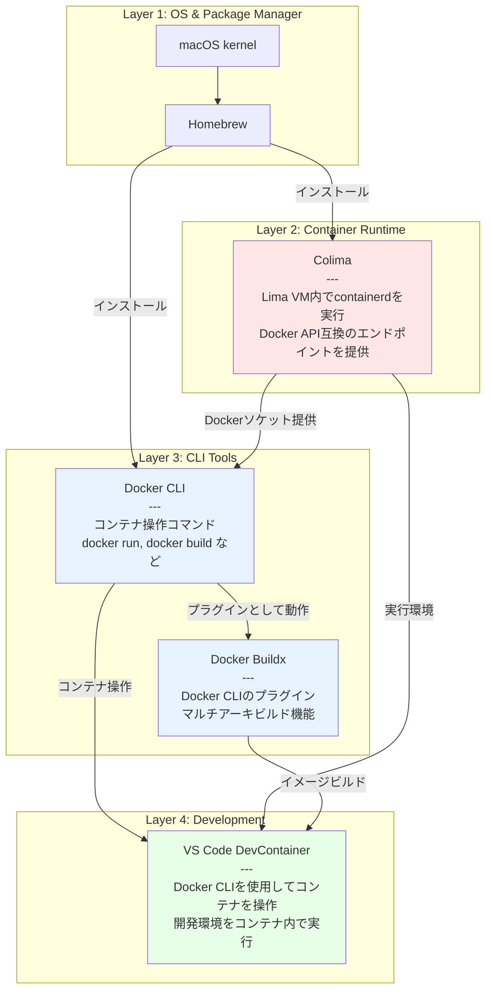
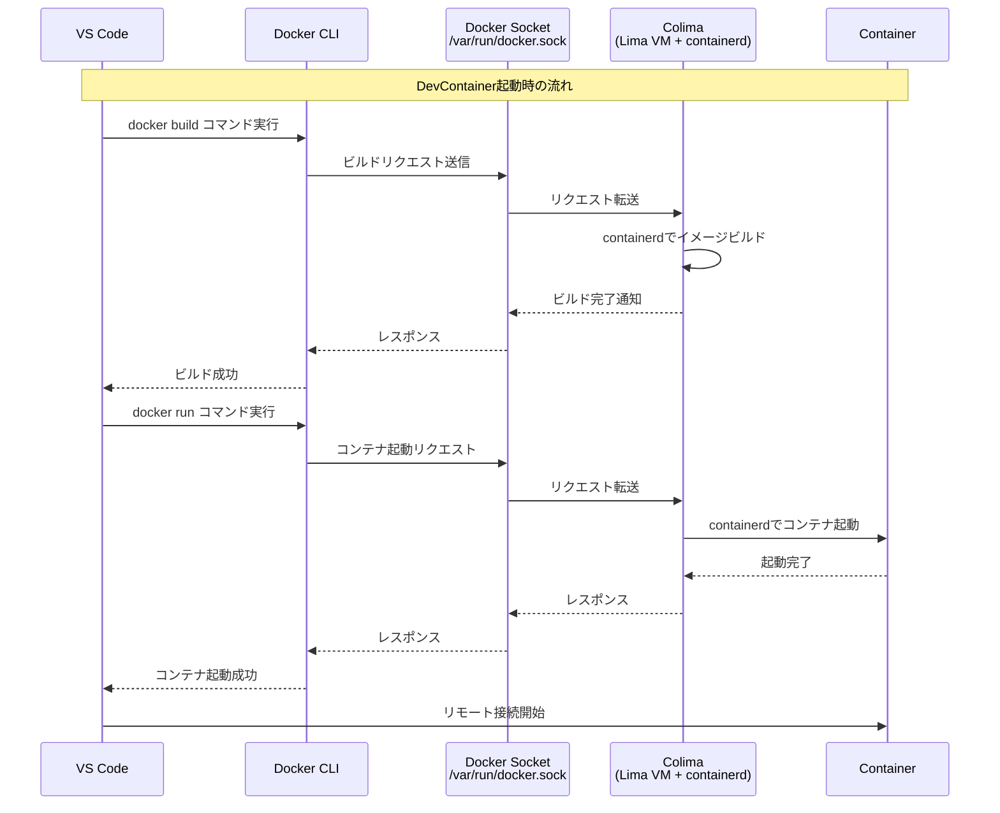
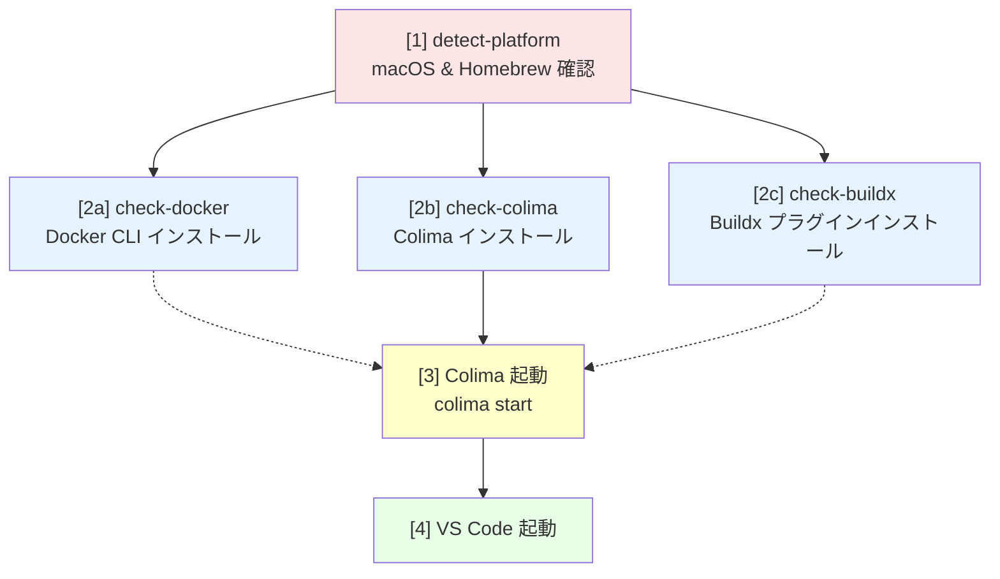

# VS Code DevContainer with AI Assistants

このプロジェクトは、[VS Code DevContainers](https://code.visualstudio.com/docs/devcontainers/containers) を使った AI 支援開発環境のサンプルです。
コンテナ技術を利用することで、ローカル環境を汚さずに、誰でも同じ開発環境を素早く構築できます。

## 主な特徴

- **AI コーディング支援:** Gemini CLI、Claude Code、OpenAI Codex が利用可能
- **軽量な環境:** Alpine Linux ベースの Node.js 24 環境
- **一貫性:** DevContainer を使うことで、OS の違い（macOS, Windows, Linux）を問わず、統一された環境で開発できます。
- **拡張機能の推奨:** AI コーディング支援ツール（`google.gemini-code-assist`, `Anthropic.claude-code`）が推奨されます。

## セットアップ方法

### 前提条件

- [Visual Studio Code](https://code.visualstudio.com/)
- [DevContainers](https://marketplace.visualstudio.com/items?itemName=ms-vscode-remote.remote-containers) VS Code 拡張機能

---

### 起動手順

1.  **プロジェクトをクローンする**
    
    ```bash
    git clone https://github.com/BlueEventHorizon/DevContainer
    cd DevContainer
    ```
    
2.  **Docker Desktop の代替 (macOS ユーザー向け)**
    Docker Desktop が利用できない、または利用したくない場合に、[Colima](https://github.com/abiosoft/colima) を利用して代替環境を構築できます。

    **初回セットアップ:**
    以下のコマンドは、必要なツール（Docker, Colima）のインストールと Colima の起動を一度に行います。初めて環境を構築する際に一度だけ実行してください。

    ```bash
    make install
    ```

    **2回目以降の起動と停止:**
    セットアップが完了している場合、開発作業の開始時に以下のコマンドで Colima を起動します。

    ```bash
    colima start
    ```

    作業が終了したら、以下のコマンドで Colima を停止してください。

    ```bash
    colima stop
    ```

3.  **DevContainer で開く**
    VS Code でこのプロジェクトフォルダを開くと、右下に「Reopen in Container」という通知が表示されます。これをクリックしてください。
    
    通知が表示されない場合は、コマンドパレット (`Ctrl+Shift+P` または `Cmd+Shift+P`) を開き、「`Dev Containers: Reopen in Container`」を実行します。

4.  **完了**
    コンテナのビルドが完了すると、VS Code がコンテナに接続された状態で再起動します。これでセットアップは完了です。

## 使い方

### AI コーディング支援ツール

コンテナ環境の準備ができたら、以下のツールが利用できます:

#### Gemini CLI

VS Code 内で新しいターミナルを開き、以下のコマンドで利用できます。

```bash
# gemini コマンドの存在確認
gemini --help
```

`package.json` に定義された npm script を経由して実行することも可能です。

```bash
npm run gemini -- --help
```

#### Claude Code

VS Code 内で新しいターミナルを開き、以下のコマンドで利用できます。

```bash
# claude コマンドの存在確認
claude --help
```

`package.json` に定義された npm script を経由して実行することも可能です。

```bash
npm run claude -- --help
```

#### OpenAI Codex

VS Code 内で新しいターミナルを開き、以下のコマンドで利用できます。

```bash
# codex コマンドの存在確認
codex --help
```

`package.json` に定義された npm script を経由して実行することも可能です。

```bash
npm run codex -- --help
```

## 既存プロジェクトへのインストール

この AI DevContainer 環境を既存のプロジェクトに追加できます。

### 自動インストール（推奨）

インストールスクリプトを使用して自動的にセットアップできます：

```bash
# 基本的な使い方
./install-devcontainer.sh /path/to/your/project

# 既存ファイルをバックアップしながらインストール
./install-devcontainer.sh --backup /path/to/your/project
```

スクリプトは以下の処理を自動で行います：

1. `.devcontainer/` ディレクトリのコピー
2. `package.json` の自動マージ（既存の場合は devDependencies と scripts を追加）
3. `.gitignore` の確認と更新（`node_modules/` の追加）
4. `Makefile` のコピー（オプション、macOS ユーザー向け）

### 手動インストール

手動でインストールする場合は、以下のファイルをコピーしてください：

1. **必須**: `.devcontainer/` ディレクトリ全体
2. **必須**: `package.json` に以下を追加（既存ファイルがある場合はマージ）
   ```json
   {
     "devDependencies": {
       "@anthropic-ai/claude-code": "latest",
       "@google/gemini-cli": "latest",
       "@openai/codex": "latest"
     },
     "scripts": {
       "gemini": "gemini",
       "claude": "claude",
       "codex": "codex"
     }
   }
   ```
3. **推奨**: `.gitignore` に `node_modules/` を追加
4. **オプション**: `Makefile`（macOS で Docker Desktop を使わない場合）

インストール後、VS Code でプロジェクトを開き、「Dev Containers: Reopen in Container」を実行してください。

## ファイル構成

- **`.devcontainer/`**: DevContainer の設定ファイルが含まれています。
  - `devcontainer.json`: ポート、拡張機能、ビルド方法などを定義します。
  - `Dockerfile`: コンテナのベースイメージと、インストールするソフトウェアを定義します。
- **`package.json`**: プロジェクトの依存関係と npm スクリプトを定義します。
- **`install-devcontainer.sh`**: 既存プロジェクトへの自動インストールスクリプト
- **`Makefile`**: (macOS ユーザー向け) Docker Desktop の代替として Colima をセットアップするためのヘルパーコマンドが定義されています。
- **`.vscode/`**: VS Code エディタに固有の設定が含まれています。
  - `extensions.json`: このプロジェクトで推奨される VS Code 拡張機能を定義します。

## Makefile 詳細

この Makefile は、macOS 上で Docker Desktop の代替として Colima を使用した DevContainer 環境をセットアップするためのものです。主に以下の3つのコンポーネントを管理します:

- **Docker CLI**: コンテナ操作のためのコマンドラインツール
- **Colima**: Docker Desktop の代替となる軽量なコンテナランタイム
- **Docker Buildx**: マルチプラットフォームビルドをサポートするプラグイン

### 利用可能なコマンド

| コマンド | 説明 |
|---------|------|
| `make install` | 環境全体をセットアップして起動 |
| `make uninstall` | すべてのコンポーネントをアンインストール |

### ランタイム依存関係

各コンポーネントのランタイムでの役割と依存関係:



#### 各コンポーネントの役割

| コンポーネント | 役割 | 依存先 | 提供するもの |
|--------------|------|--------|------------|
| **Colima** | コンテナランタイム環境。Lima VM 内で containerd を実行し、Docker 互換の API エンドポイント (`/var/run/docker.sock`) を提供 | macOS, Lima, containerd | Docker ソケット (`unix:///var/run/docker.sock`) |
| **Docker CLI** | コンテナ操作のためのコマンドラインツール。Colima が提供する Docker ソケットに接続 | Colima (実行中のソケット) | `docker` コマンド |
| **Buildx** | Docker CLI のプラグイン。マルチプラットフォームビルドを可能にする | Docker CLI | `docker buildx` コマンド |
| **DevContainer** | VS Code の機能。Docker CLI を使ってコンテナを起動し、開発環境として使用 | Docker CLI, Colima (実行中) | 統合開発環境 |

#### なぜこの構成なのか？

**Docker Desktop の代替として Colima を使用**:
- Docker Desktop はライセンス料が必要（企業利用）
- Colima は OSS で無料
- Colima は軽量（Lima VM ベース）

**Docker CLI と Colima は別コンポーネント**:
- Docker CLI: クライアント（コマンド）
- Colima: サーバー（実行環境）
- 分離されているため、どちらか一方を更新しても影響が少ない

**Buildx はプラグイン**:
- Docker CLI 本体とは独立してインストール
- `~/.docker/cli-plugins/` に配置されると自動認識される
- DevContainer のマルチアーキビルドに必要

#### ランタイム時の通信フロー



#### インストール依存関係

Makefile がコンポーネントをインストールする際の依存関係:



**注意**:
- ステップ2（a/b/c）は並列実行される（Makeの依存関係により）
- Colima の起動には Docker CLI は不要だが、実行時には必要
- Buildx は Docker CLI のプラグインだが、インストール順序は問わない（プラグインディレクトリに配置されるだけ）